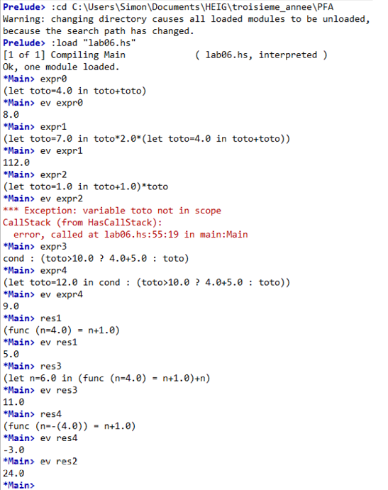

# Programmation fonctionnelle avancée - Laboratoire 6

## Introduction

Ce Laboratoire a pour but de proposer un petit interpréteur de programmation basique écrit en Haskell
et qui s'occupe d'évaluer différentes expressions (sommes, produits, énoncés conditionnels,...). Toutes les expressions
dérivent d'un type générique et permettent ainsi la construction d'un arbre syntaxique abstrait pour des expressions composées complexes.

## Définition des expressions

Les expressions sont définies sous la forme d'un type récursif et s'expriment sous la
forme suivante :

```Haskell
data Expr = Const Double | BinaryOp Char Expr Expr | If Expr Expr Expr | ...
```

Les diffétents catégories d'expressions sont les suivantes :

* **Feuilles de l'arbre sytaxique**

Les expressions qui ne possèdent plus de sous-expressions (noeuds terminaux) sont soit un nombre réel soit un string représentant une variable par son nom. Nous verrons
plus tard que l'évaluation d'un string consiste en la recherche d'une valeur correspondant à la variable dans un environnement spécifique à l'expression évaluée.

* **Opérateurs binaires**

Six opérateurs binaires sont fournis (somme, produit, soustraction, division, inférieur, suppérieur, ), il s'agit des expressions possédant un opérateur (déterminé par un caractère) ainsi que deux expressions pour les opérandes.

* **Opérateurs unaires**

Pour les deux opérateur unaires fournis (opposé et négation), il s'agit également de déterminer l'opérateur par un caractère et de définir une expression à évaluer par cet opérateur.

* **Enoncés conditionnels**

Pour évaluer les conditions, nous supposons pour simplifier qu'elles retournent un nombre réel (0.0 ou 1.0). Cela nous permet de les rendre compatibles avec les autres expressions lors de la construction de l'arbre (dont les feuilles sont des nombre réels).

Ces énoncés comprennent une première expression pour la condition, une deuxième à évaluer si la première est vraie (1.0) et une troisième dans le cas contraire.

* **Affectation d'une variable**

L'affection d'une valeur dans une variable se fait ici comme en Haskell sous la forme

```Haskell
Let var expr1 expr2
```

où l'on attribue le résultat de expr1 à la variable var puis on utilise le résultat dans expr2.
Pour rendre ceci possible, un environnement propre à chaque expression (local) constitué d'une liste de tuples (clés - valeurs) est passé comme premier argument `env` à la fonction polymorphique.

Lorsque l'on appelle la fonction d'évaluation sur le type d'expression ci-dessus, expr1 est évaluée, son résultat est inséré grâce à une fonction annexe dans l'environnement (si la variable existe déjà, sa valeur est écrasée sinon ajoutée à la fin de la liste) puis la fonction *eval* est appelée sur expr2 avec l'environnement ainsi mis à jour.

La liste `env` ressemble un peu à une Map (String - Double) et une deuxième fonction annexe permet de rechercher la valeur associée à une clé string unique ou de lever une exception avec *error* dans le cas contraire. La différence avec une Map réside dans le fait que les fonctions d'ajout et de recherche nécéssitent le parcours de la liste et s'opèrent donc en *O(n)*. L'exemple ci-dessous illustre l'intérêt de n'avoir qu'une seule valeur possible pour un nom de variable donné :

```
let toto = 7 in toto * (let toto = 4 in toto + toto)
```

En effet, si une deuxième variable *toto* était ajoutée en fin de liste dans la deuxième expression, la première variable serait prise en compte à la place dans l'évaluation et on n'obtiendrait pas le résultat escompté.

* **Utilisation d'une variable**

L'utilisation d'une variable par son nom dans une expression consiste donc simplement à appeler la fonction annaexe *getValue* qui s'occupera de retourner la valeur associée au nom de variable. Il s'agit en fait de l'évaluation du type d'expression `Str String`.

* **Appel de fonctions**

L'appel d'une fonction à un paramètre ssemble furieusement à l'énoncé précédent et peut s'écrire : `f(n) = let n expr1 expr2(n)`. Un nouveau type d'expression permet de définir une fonction et un second de l'évaluer avec un argument spécifique passé en paramètre. On peut donc par exemple définir et appliquer une fonction ainsi:

```Haskell
incr = Func "n" (BinaryOp '+' (Str "n") (Const 1))
res = ApplyFunc incr (Const 4)
```
mais également des fonctions récursives comme nous le verrons dans les exemples d'exécutions. Dans ce cas, la valeur de la variable *n* dans la liste `env` est écrasée à chaque appel récursif.

## Exemples d'exécutions

Différentes expressions sont définies à la fin du fichier .hs fourni et permet de visualiser toutes les opérations qui ont été définies. Pour afficher grâce à leurs fonctions *show* respectives ce qu'elles sont responsables de faire, il suffit de taper leurs noms dans la console. Pour afficher leurs réultats, il faut taper `ev expr`, qui est en fait un appel "wrapper" à la fonction `eval` avec une liste vide comme environnement de départ. La figure ci-dessous résume donc toutes ces opérations.



Notons que l'évaluation de l'expression 2 lève bien une exception car la variable *toto* n'est définie que dans l'expression de gauche (première opérande de la multiplication) et est donc inaccessible dans l'expression de droite (deuxième opérande). L'environnement est bien local à l'expression qui est évaluée puisque une copie de celui-ci est fourni à la fonction d'évaluation de chaque expression. Notons également que la fonction factorielle n'est pas affichée dans l'exemple ci-dessus car cela générerait une boucle infinie d'affichage, la fonction étant récursive.
